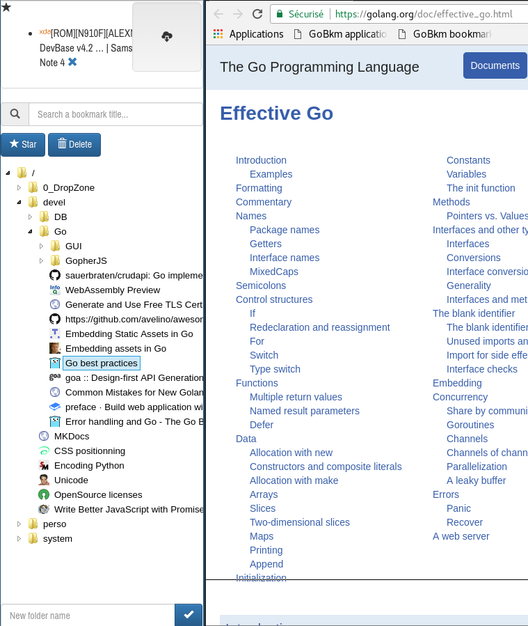

# GoBkm

GoBkm is an *ultra minimalist single user online bookmark manager* inspired by <http://sitebar.org/> written in [Go](https://golang.org/) and Javascript.  
It is designed to run on a remote server (I run it on a [RaspberryPi](https://www.raspberrypi.org/)) and accessed remotely.

The purpose of this project was to study the Go programming language in its different aspects (OOP, databases, HTML templates, learning curve).



## Usage

```bash
    ./gobkm # run GoBkm on localhost:8080
```

You can change the listening port with:
```bash
    ./gobkm -port [port_number]
```

Using an HTTP proxy (Apache/Nginx), specify its URL with:
```bash
    ./gobkm -port [port_number] -proxy [proxy_url]
```

Debug mode:
```bash
    ./gobkm -debug
```

## GUI

Drag and drop an URL from your Web browser address bar into a folder to bookmark it. Rename/delete folders and bookmarks by dragging them on the icons on the top.

## Bookmarklet

Drag the bookmarklet on your bookmark bar.

Click it to open the GoBkm bar, resize and place it wherever you want.

## Nginx proxy with user authentication

- create a `gobkm` user and group, and a home for the app

    ```bash
        groupadd --system gobkm
        useradd --system gobkm --gid gobkm
        mkdir /usr/local/gobkm
    ```

- drop the bkm binary into the `/usr/local/gobkm` directory

- setup permissions

    ```bash
        chown -R  gobkm:gobkm /usr/local/gobkm
        cd /usr/local/gobkm
    ```

- launch GoBkm

    ```bash
        cd /usr/local/gobkm
        su - gobkm -c "/usr/local/gobkm/gobkm -proxy http://proxy_url" &
    ```

- setup a Nginx server

    ```bash
    server {

        listen 80;
        # change proxy_url
        server_name proxy_url;
          
        root          /usr/local/gobkm;  
        charset utf-8;
       
        # uncomment to enable authentication
        # details at: http://nginx.org/en/docs/http/ngx_http_auth_basic_module.html
        #auth_basic "GoBkm";
        #auth_basic_user_file /usr/local/gobkm/gobkm.htpasswd;

        location / {
            # change the port if needed
            proxy_pass http://127.0.0.1:8080;
        }

    }
    ```

## Thanks

Thanks to [Sébastien Binet](https://github.com/sbinet) for the tutorial and help.

## Roadmap

- provide a systemd startup script
- translate the Javascript into gopherjs <https://github.com/gopherjs/gopherjs>
- do not reload folder content from server at each click
- ~~import export feature (HTML?)~~

## Known limitations

- no user management
- no authentication (relies on the HTTP proxy)
- folders and bookmarks are sorted by title (currently not configurable)
- supports only latest versions of Web browsers

## Notes

Cross compiled under Arch Linux with:
```bash
    # requires the package arm-linux-gnueabihf-gcc
    env GOOS=linux GOARCH=arm GOARM=7 CGO_ENABLED=1 CC=/usr/bin/arm-linux-gnueabihf-gcc go build .
```

## Credits

- sites favicon retrieved from [Google](http://www.google.com)
- folders, bookmarks, rename and delete icons from the [FontAwesome](https://fontawesome.github.io/Font-Awesome/) library
- drag ghost icon from the [OpenClipart](https://openclipart.org/)
- GoBKM SVG favicon build with [Inkscape](http://www.inkscape-fr.org/) from <https://github.com/golang-samples/gopher-vector> and <https://commons.wikimedia.org/wiki/File:Bookmark_empty_font_awesome.svg>
- favicon PNG generated from <https://realfavicongenerator.net>

## References

- <http://youmightnotneedjquery.com/>
- <http://gomakethings.com/climbing-up-and-down-the-dom-tree-with-vanilla-javascript/>
- <https://golang.org>
- <https://github.com/jteeuwen/go-bindata>
- <https://godoc.org/github.com/GeertJohan/go.rice>
- <http://www.w3schools.com/>
- <http://blog.teamtreehouse.com/uploading-files-ajax>
- <https://joeshaw.org/net-context-and-http-handler/>
- <https://medium.com/@matryer/the-http-handlerfunc-wrapper-technique-in-golang-c60bf76e6124#.xx66llwp4>
- <http://wpvkp.com/font-awesome-doesnt-display-in-firefox-maxcdn/>
