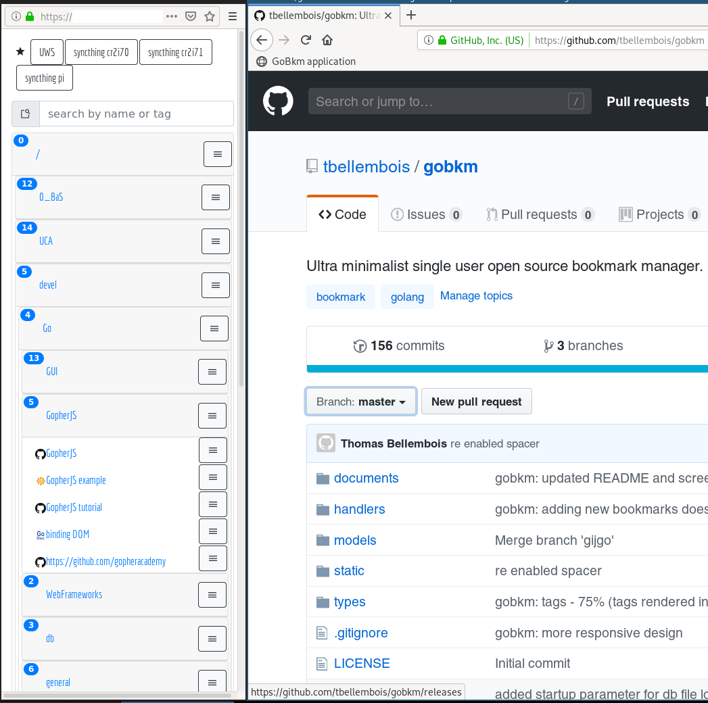

# GoBkm

GoBkm is an *ultra minimalist single user online bookmark manager* inspired by <http://sitebar.org/> written in [Go](https://golang.org/) and [GopherJS](http://www.gopherjs.org/).  
It is designed to run on a remote server (I run it on a [RaspberryPi](https://www.raspberrypi.org/)) and accessed remotely.

The purpose of this project was to study the Go programming language in its differents aspects (OOP, databases, HTML templates, learning curve).



## Installation

Download and uncompress the latest release from <https://github.com/tbellembois/gobkm/releases>.

## Usage

```bash
    ./gobkm # run GoBkm on localhost:8080
```

You can change the listening port with:
```bash
    ./gobkm -port [port_number]
```

Using an HTTP proxy (Apache/Nginx), specify its URL with:
```bash
    ./gobkm -port [port_number] -proxy [proxy_url]
```

Log to file
```bash
    ./gobkm -logfile /var/log/gobkm.log
```

Debug mode (by default only errors are shown):
```bash
    ./gobkm -debug
```

## GUI

- drag and drop an URL from your Web browser address bar into a folder to bookmark it OR
- use the bookmarklet to bookmark the current page
- delete folders and bookmarks by dropping them on the bin icon
- rename folders and bookmarks with the "r" key
- star/unstar bookmarks with the star icons

## Bookmarklets

The "B" bookmarklet open GoBkm.
The "B+" bookmarklet bookmarks the current page (alternative to the drag and drop method).

## Nginx proxy (optional)

### GoBkm installation

You can use Nginx in front of GoBkm to use authentication and HTTPS.

- create a `gobkm` user and group, and a home for the app

    ```bash
        groupadd --system gobkm
        useradd --system gobkm --gid gobkm
        mkdir /usr/local/gobkm
    ```

- drop the bkm binary into the `/usr/local/gobkm` directory

- setup permissions

    ```bash
        chown -R  gobkm:gobkm /usr/local/gobkm
        cd /usr/local/gobkm
    ```

- launch GoBkm

    ```bash
        cd /usr/local/gobkm
        su - gobkm -c "/usr/local/gobkm/gobkm -proxy http://proxy_url" &
    ```

### Nginx configuration

- setup a GoBkm server configuration file such as `/etc/nginx/servers-available/gobkm.conf`

    ```bash
    server {

        listen 80;
        # change proxy_url
        server_name proxy_url;
          
        root          /usr/local/gobkm;  
        charset utf-8;
    
        # uncomment and change to enable HTTPS
        #ssl on;
        #ssl_certificate /etc/nginx/ssl2/my-gobkm.crt;
        #ssl_certificate_key /etc/nginx/ssl2/my-gobkm.key;

        # uncomment to enable authentication
        # details at: http://nginx.org/en/docs/http/ngx_http_auth_basic_module.html
        #auth_basic "GoBkm";
        #auth_basic_user_file /usr/local/gobkm/gobkm.htpasswd;

        location / {

		  	# preflight OPTIONS requests response
			if ($request_method = 'OPTIONS') {
				add_header 'Access-Control-Allow-Credentials' 'true';
				add_header 'Access-Control-Allow-Origin' '*';
				add_header 'Access-Control-Allow-Methods' 'GET, POST, OPTIONS';
				#
				# Custom headers and headers various browsers *should* be OK with but aren't
				#
				add_header 'Access-Control-Allow-Headers' 'DNT,X-CustomHeader,Keep-Alive,User-Agent,X-Requested-With,If-Modified-Since,Cache-Control,Content-Type';
				#
				# Tell client that this pre-flight info is valid for 20 days
				#
				add_header 'Access-Control-Max-Age' 1728000;
				add_header 'Content-Type' 'text/plain charset=UTF-8';
				add_header 'Content-Length' 0;
				return 204;
			}

            # change the port if needed
        	proxy_set_header Upgrade $http_upgrade;
        	proxy_set_header Connection 'upgrade';
        	proxy_pass http://127.0.0.1:8080;
        }

    }
    ```

- enable the new site

    ```bash
        $ ln -s /etc/nginx/servers-available/gobkm.conf /etc/nginx/servers-enabled/
        $ systemctl restart nginx
    ```

### SSL self-signed certificate generation (optional)

```bash
	# generate a root CA key
	openssl genrsa -out rootCA.key 2048
	# the a root CA
	openssl req -x509 -new -nodes -key rootCA.key -days 3650 -out rootCA.crt
	# generate a server key  
    openssl genrsa -out my-gobkm.key 2048
	# then a CSR (certificate signing request)
	openssl req -new -key my-gobkm.key  -out my-gobkm.csr
	# and finally auto signing the server certificate with the root CA
    openssl x509 -req -in my-gobkm.csr -CA rootCA.crt -CAkey rootCA.key -CAcreateserial -out my-gobkm.crt -days 3650
```
To avoid security exceptions just import your `rootCA.crt` into your browser.

## Thanks

Thanks to [Sébastien Binet](https://github.com/sbinet) for the tutorial and help on Go.  
Thanks to [Dmitri Shuralyov](https://github.com/shurcooL) for the help on GopherJS.

## Roadmap

- provide a systemd startup script
- do not reload folder content from server at each click
- ~~translate the Javascript into gopherjs <https://github.com/gopherjs/gopherjs>~~
- ~~import export feature (HTML?)~~

## Known limitations

- no user management
- no authentication (relies on the HTTP proxy)
- folders and bookmarks are sorted by title (currently not configurable)
- the B+ bookmarklet will NOT work with sites with CSP restrictions

## Notes

Cross compiled for the RaspberryPi under Arch Linux with:
```bash
    # requires the package arm-linux-gnueabihf-gcc
    env GOOS=linux GOARCH=arm GOARM=7 CGO_ENABLED=1 CC=/usr/bin/arm-linux-gnueabihf-gcc go build .
```

Javascript generation:
```bash
    gopherjs build static/js/gjs-main.go -o static/js/gjs-main.js
```

## Credits

- sites favicon retrieved from [Google](http://www.google.com)
- folders, bookmarks, rename and delete icons from the [FontAwesome](https://fontawesome.github.io/Font-Awesome/) library
- GoBKM SVG favicon build with [Inkscape](http://www.inkscape-fr.org/) from <https://github.com/golang-samples/gopher-vector> and <https://commons.wikimedia.org/wiki/File:Bookmark_empty_font_awesome.svg>
- favicon PNG generated from <https://realfavicongenerator.net>

## References

- <http://youmightnotneedjquery.com/>
- <http://gomakethings.com/climbing-up-and-down-the-dom-tree-with-vanilla-javascript/>
- <https://golang.org>
- <https://github.com/jteeuwen/go-bindata>
- <https://godoc.org/github.com/GeertJohan/go.rice>
- <http://www.w3schools.com/>
- <http://blog.teamtreehouse.com/uploading-files-ajax>
- <https://joeshaw.org/net-context-and-http-handler/>
- <https://medium.com/@matryer/the-http-handlerfunc-wrapper-technique-in-golang-c60bf76e6124#.xx66llwp4>
- <http://wpvkp.com/font-awesome-doesnt-display-in-firefox-maxcdn/>
